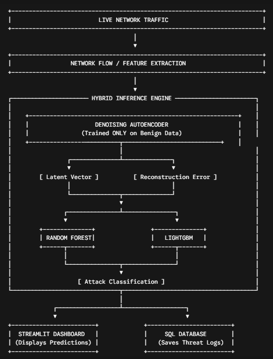
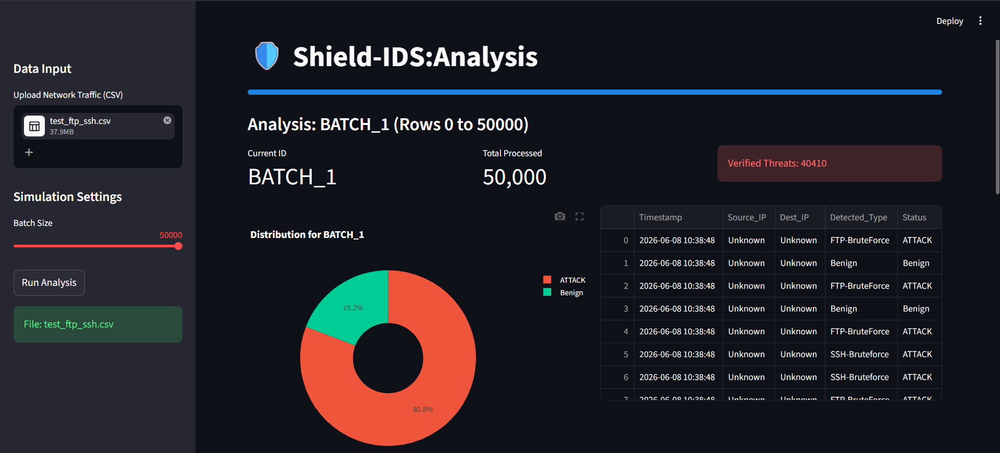
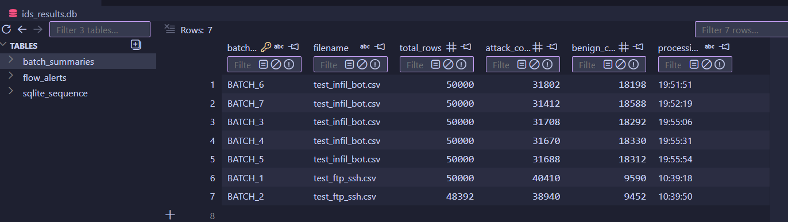
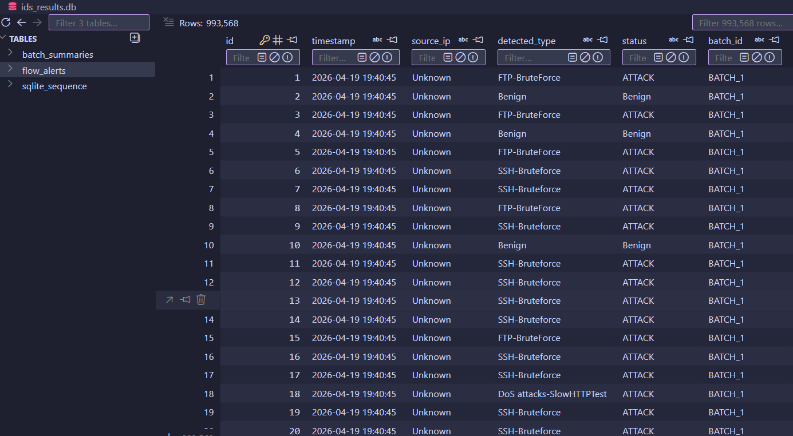
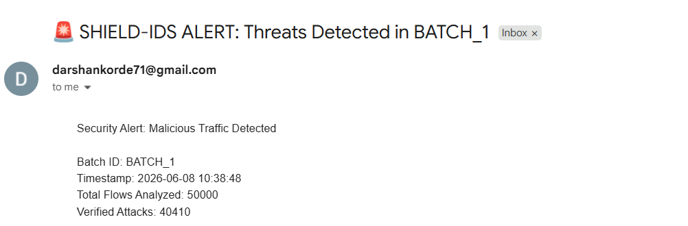
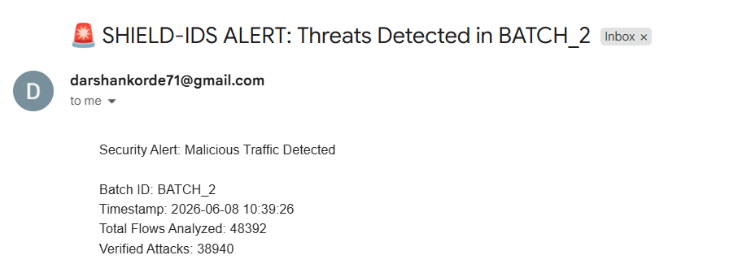

# Hybrid Intrusion Detection System (IDS)

An end-to-end, real-time Intrusion Detection System that combines deep learning feature extraction with machine learning classification to identify network attacks.

---

## 🏗️ System Architecture



---

## 🚀 Key Workflow

1. **Denoising Autoencoder (DAE):** The deep learning core is trained **exclusively on benign data** to learn standard, uncorrupted network patterns. 
2. **Feature Extraction:** When real-time data flows through the DAE, it extracts two critical metrics:
   * **Latent Vector:** Compressed low-dimensional representations of the traffic.
   * **Reconstruction Error:** Higher anomalies/deviations indicate potential attacks.
3. **Classification Ensemble:** The *Latent Vector* and *Reconstruction Error* are passed simultaneously into **Random Forest** and **LightGBM** models to classify specific attack variations.
4. **Outputs:**
   * **Streamlit Dashboard:** Displays live, real-time prediction results and analytics.
     
   * **SQL Database:** Permanently saves system logs and malicious alerts for auditing.
     
     
     
     

---

## ⚙️ Quick Start

```bash
# 1. Install Dependencies
pip install tensorflow keras scikit-learn lightgbm streamlit pandas numpy

# 2. Launch the System & Streamlit Dashboard
streamlit run ids_pipeline_static.py
